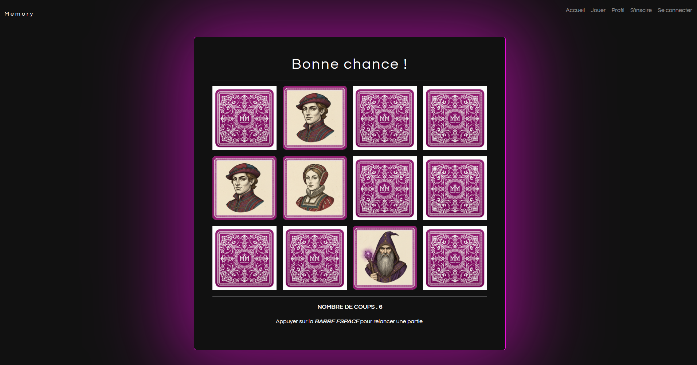

 # 🧠 Memory Game

Un jeu de mémoire interactif développé en **JavaScript**.
Le but est simple : retrouver toutes les paires de cartes en un minimum de coups !


[**👉 VOIR LA DÉMO EN LIVE ICI**](https://kmilleee.github.io/Memory/)



## 📋 Contexte

Ce projet a été réalisé dans le cadre de ma formation **Développeur Web & Web Mobile** à l'ENI Ecole Informatique.
L'objectif était de consolider mes compétences en algorithmique et en manipulation du DOM.


## 🛠️ Stack Technique

* **HTML5** : Structure sémantique.
* **Bootstrap 5** : Utilisation du système de Grille (Grid) pour le placement des cartes et composants pour la barre de navigation/score. Permet un rendu **100% Responsive** (Mobile First).
* **CSS3 Personnalisé** : Animations 3D (flip des cartes) que Bootstrap ne gère pas par défaut.
* **JavaScript (ES6+)** : Logique complète du jeu (Algorithme de mélange, gestion des paires, victoire).


## ✨ Fonctionnalités

* 🔀 **Mélange aléatoire** des cartes à chaque nouvelle partie (Algorithme de Fisher-Yates).
* 🔢 **Compteur de coups** : Le joueur est challengé pour finir la partie en un minimum de mouvements.
* 📱 **Responsive Design** : Interface adaptable grâce à **Bootstrap 5**.
* 🚫 **Logique de jeu** : Gestion des tours, blocage du plateau pendant les animations et validation des paires.


## 🚀 Installation & Lancement

Si vous souhaitez tester le code en local :

1.  Clonez le repo :

    ```bash
    git clone https://github.com/Kmilleee/Memory.git
    ```

2.  Ouvrez le fichier `index.html` dans votre navigateur.

## 💡 Ce que j'ai appris

Ce projet m'a permis de travailler sur :

* La manipulation du **DOM** en temps réel.
* La gestion de la logique conditionnelle (comparaison des paires).
* L'utilisation des `setTimeout` pour gérer les délais d'affichage (laisser les cartes visibles quelques secondes avant de les retourner)
* L'écriture d'un code propre et commenté.


## 👤 Auteur

**Camille PAYEN**

* LinkedIn : [Mon Profil](https://www.linkedin.com/in/camille-payen-0b18b3342/)
* GitHub : [@Kmilleee](https://github.com/Kmilleee)

---

*N'hésitez pas à me faire des retours ou à ouvrir une Issue si vous trouvez un bug !* 🐛 